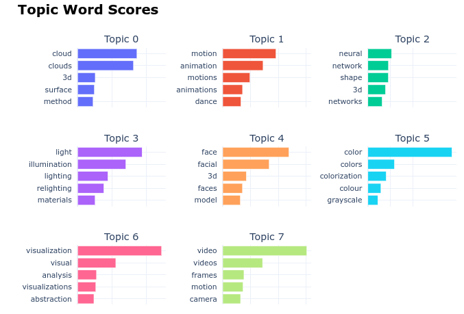
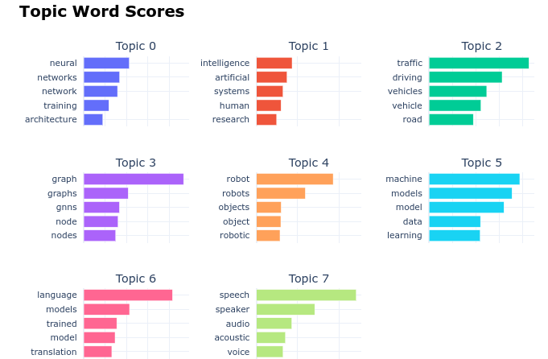
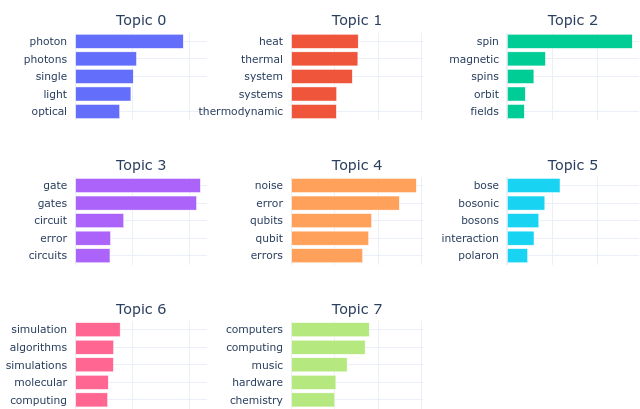
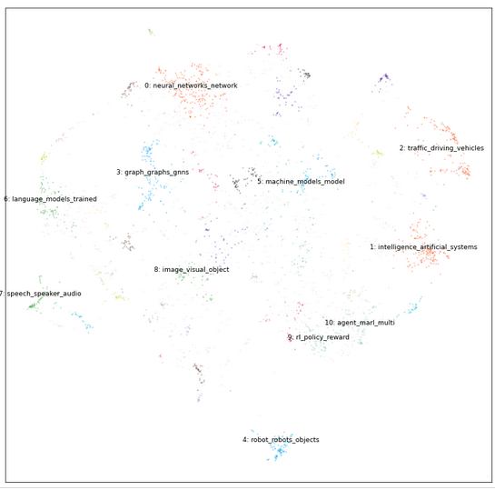
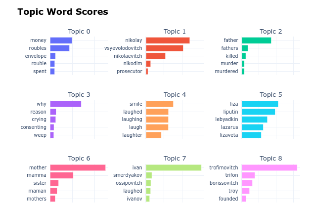
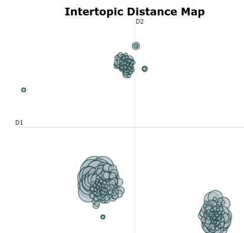
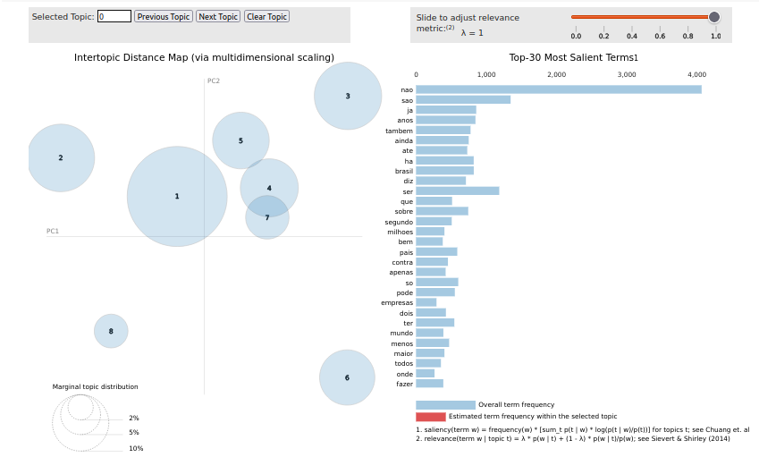
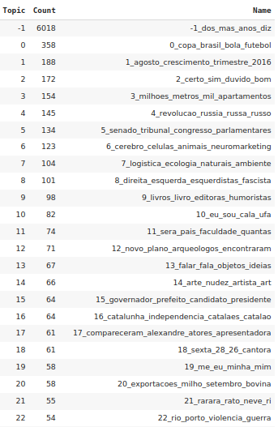

# Topic-Modeling-in-Different-Domains-with-BERTopic

Diany Pressato e Matheus da Silva Araujo

## Conteúdo

- [Sobre](#sobre)
- [Dados](#dados)
- [Análises](#methodology)
- [Resultados](#results)

---

## Sobre

<table>
<tr>
<td>  
    Jupyter Notebook interativo contendo análises e resultados da modelagem de tópicos em conjuntos de dados distintos (livros, artigos científicos e notícias) utilizando-se e comparando-se os modelos BERTopic, LDA (Latent Dirichlet Allocation) e NMF (Non-Negative Matrix Factorization). O objetivo consiste em gerar insights sobre o conjunto de dados, como por exemplo, os principais temas/assuntos tratados por notícias e artigos científicos de um determinado período, bem como obter detalhes sobre o enredo de um livro.

    Exemplo de alguns dos resultados obtidos:

    1. Tópicos relativos ao dataset de artigos científicos:

    </img>

    </img>

    </img>

    2. Redução de dimensionalidade utilizando-se o UMAP para o dataset de artigos científicos:

    </img>

    3. Tópicos obtidos para o dataset de livros (Livros do autor Dostoiévski):

    </img>

    4. Distância entre os tópicos obtidos para o dataset de livros (Livros do autor Dostoiévski):

    </img>

    5. Tópicos obtidos pelo LDA em relação ao dataset de notícias:

    </img>

    6. Lista de tópicos obtidos em relação ao dataset de notícias:

    </img>

    COLOCAR CóDIGOS PRE PROCESSAMENTO!
</td>
</tr>
</table>

---

## Dados

Os domínios analisados envolvem textos de livros, artigos científicos e notícias.

* Domínio de artigos científicos (ArXiv)

    * Diversos artigos científicos (*papers*) do site ArXiv através de uma biblioteca em Python que se comunica com a API pública do site. 

    * Foram feitas diversas requisições de diversas categorias de artigos científicos (como inteligência artificial, aprendizado de máquina, robótica, genômica, dentre outros). Para cada categoria, foram coletadas as seções *abstract*  de 3000 artigos científicos em dez categorias diferentes, totalizando um conjunto de dados de 30000 artigos científicos coletados. Embora a implementação realizada tenha baixado apenas o *abstract* de cada artigo, em trabalhos futuros seria simples implementar uma funcionalidade para baixar várias outras informações, como referências ou o corpo inteiro do artigo, bastando alterar a requisição feita à API.

    * Os arquivos foram baixados por ordem de publicação no site do ArXiv; isto é, para cada categoria, foram baixados os 3000 artigos mais recentemente publicados. Isso permite fazer uma análise qualitativa dos principais tópicos mais recentemente pesquisados em diversas áreas do conhecimento, como discutido a partir dos resultados obtidos.

    * O conteúdo do *abstract* dos artigos científicos baixados, no entanto, é texto em formato LaTeX. Por isso, foi necessário implementar uma etapa extensa de pré-processamento de textos para remover caracteres e comandos especiais do LaTeX (como \matbhf, \href e $$), expressões e símbolos matemáticos (como letras gregas utilizadas como símbolos em fórmulas), caracteres que não podem ser imprimidos, dentre outros. Também foi necessário processar e remover pontuações, acentuações e outros símbolos dos textos para as técnicas de LDA e NMF.

* Domínio de Livros (Projeto Gutenberg)

    * Os livros foram extraídos do site do Projeto Gutenberg. 

    * Os livros estão na língua inglesa, sendo que os respectivos textos passaram por um pré processamento para a remoção de imagens, títulos, cabeçalhos e demais "ruídos" presentes que não são pertencentes ao conteúdo semântico do enredo.

* Domínio de Notícias:

    * Foi utilizado o dataset da Folha de São Paulo

    * Este dataset já possui dados pré-processados. Entretanto, para a aplicação das técnicas de NMF e LDA, fez-se a remoção de stopwords, de pontuação e de acentuação

    * Também foi necessário realizar um processamento de sentenças, pois sentenças com menos do que três tokens geravam erros

### Partições

Também foram analisadas as seguintes segmentações textuais para cada método:

- segmentação textual a nível de artigo/documento
- segmentação textual por sentenças

## Análises

Foram analisados os seguintes aspectos relativos à modelagem de tópicos, descrito em mais detalhes ao longo do notebook:

- Influência do tamanho do tópico;
- Diferentes pré processamentos dos dados;
- Análise da inserção de ruídos nos conjuntos de dados;
- Análise de outliers;
- Redução de dimensionalidade para a visualizações dos tópicos;
- Influência do período com que os dados foram coletados e observados;
- 

## Conclusões

* A tarefa de Topic Modeling utilizando a BERTopic, neste projeto, gerou tópicos menos intuitivos aos usuários quando aplicada ao domínio de livros. Isso se aplica tanto para a geração de tópicos de um único livro quanto na geração de tópicos por vários livros pertencentes a um determinado autor. Hipotetizamos que, como livros possuem um conteúdo textual muito grande, e como a BERTopic se limita a interpretar apenas 512 tokens por documento, a semântica como um todo não é captada pelo modelo. 

 

* A BERTopic foi a que gerou tópicos mais coerentes ao ser humano. Isso provavelmente se deve ao fato da BERTopic conseguir captar a semântica do(s) documento(s) e gerar tópicos mais interpretáveis. Os outros modelos utilizados neste projeto não abrangem a semântica do texto de modo significativo. Como a BERTopic se baseia em embbedings, sendo treinada num conjunto massivo de textos, os valores dos embbedings conseguem captar Entidades Nomeadas e diferenciar termos de acordo com o contexto em que se inserem (por exemplo, diferenciar o termo 'banco' relativo à agência bancária do termo 'banco' de praça). Os demais modelos utilizados neste projeto, por se basearem em bag of words, não preservam tal diferenciação entre termos, nem o reconhecem Entidades Nomeadas.

 

* Foi comum encontrarmos nomes de personagens como sendo palavras importantes para se descrever um tópico relativo a um determinado livro.

 

* Quando os tópicos de várias obras de um determinado autor eram modelados, o nome de personagens relativo as obras também eram palavras importantes para se descrever um tópico.

 

* A qualidade dos tópicos gerados, bem como métricas utilizadas para se avaliar geração de tópicos não são bem estabelecidos, sendo este um tema de pesquisa em aberto. Assim, há muitas situações em que a percepção do ser humano diante dos tópicos geradas é explorada, ou seja, a opinião de pessoas sobre os tópicos gerados pode servir para fins de pesquisa e aprimoramento do método.

 

* Métricas como Coerência de Tópicos tem sido estudadas como forma de avaliar os tópicos gerados. Essa métrica consiste em medir o grau de similaridade semântica entre as palavras mais importantes que descrevem um tópico. Métricas como Perplexidade também são utilizadas, porém, não se correlacionam fortemente com a intuição do ser humano diante da qualidade dos tópicos - estudos apontam que a Perplexidade pode estar, inclusive, correlacionada negativamente à intuição humana.

 

* Em relação à BERTopic, remover stopwords não pareceu afetar o modelo. Isso pode ser explicado pelo fato da BERTopic ser treinada em textos puros, que contém stopwords. Assim, ela consegue analisar semanticamente as stopwords, e identificar que estas são palavras pouco significativas semanticamente para descreverem os documentos, e portanto, para serem incluídas em tópicos.

 

* Notamos que passar uma quantidade muito pequena de documentos para a BERTopic gera muito outliers, compromentendo a interpretabilidade dos tópicos gerados. (Obs: este experimento não foi apresentado no documento. Inicialmente, pensamos que havia um erro no código e apagamos este exemplo. Depois descobrimos que era uma caractrística do modelo quando poucos documentos são passados para o modelo.

* Notamos que o pré processamento de dados é importatíssimo em relação aos modelos LDA e NMF. São extremamente sensíveis, e geram resultados muito ruins quando stopwords não são processadas - basicamente, as stopwords são selecionadas como tópicos. Entretanto, stopwords não são interpretáveis ao ser humano. Estes modelos também foram muito afetados por caracteres que não foram eliminados durante o processamento. 

